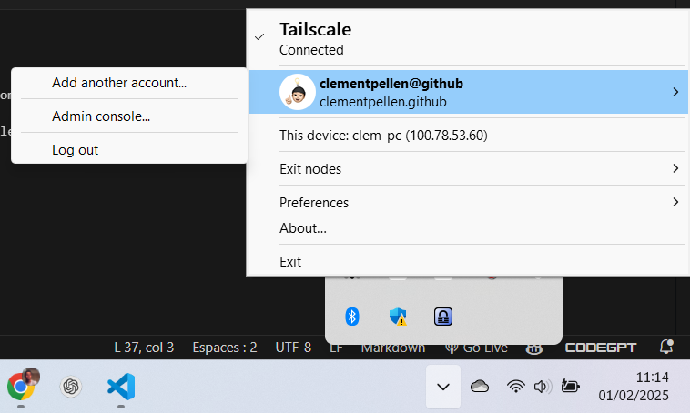

## Introduction

Pour accéder au NextCloud depuis l'extérieur, nous avons configuré un VPN.
Nous avons opté pour la solution `Tailscale` pour sa simplicité d'utilisation
et son fonctionnement basé sur les protocoles `WireGuard`.

Pour créer des connexions sécurisés entre nos différents appareils, 
nous devons installer un client compatible sur les OS suivants :
- Windows ➡️ pour les PC
- Linux ➡️ pour les Raspberry Pi
- Android ➡️ pour le smartphone de Quentin
- iOS ➡️ pour l'iPhone de Clément

 

## 1. Installation sur Windows

> Nous installons le client `Tailscale` sur Windows et non pas sur WSL Debian
> pour les 2 raisons suivantes :
> - Eviter les problématiques d'interfaces réseaux entre WSL et Windows
> (probablement difficiles à débugger dans le protocole `WireGuard`)
> - Le VPN pourrait avoir un usage autre que le projet NextCloud à l'avenir

 

Le protocole d'installation sur Windows est assez simple :

- Se rendre à l'adresse suivante : [https://tailscale.com/download/windows]
et cliquer sur **`Download Tailscale for Windows`**

- Exécuter le fichier téléchargé `TailscaleInstaller.exe`

- Accepter les conditions d'utilisation et démarrer l'installation

*L'emplacement d'installation est éditable dans l'onglet `Options`*

 

- Sélectionner le compte utilisateur à utiliser pour le service Tailscale

Perso, j'ai choisi mon compte GitHub !

 

TODO: Clarifier cette dernière partie
Je sais pas exactement comment on gère ça :

- Ajouter le compte de l'autre utilisateur Clément / Quentin

